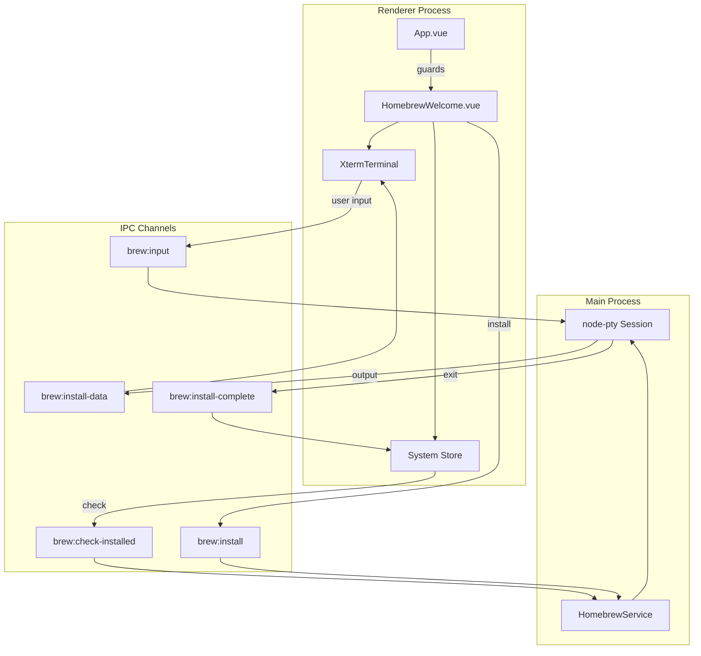

# Design Document: Homebrew Setup Guard

## Overview

本设计文档描述了 macOS 开发环境管理工具的 Homebrew 检查与强制安装流程。系统在启动时检测 Homebrew 是否已安装，如果未安装则阻止用户进入主界面，并提供一个引导页面让用户选择安装源并一键安装 Homebrew。安装过程通过 node-pty 实现交互式终端，支持用户输入密码和确认操作。

## Architecture



## Components and Interfaces

### 1. HomebrewService (Main Process)

负责检测 Homebrew 安装状态和执行安装命令。

```typescript
type MirrorSource = 'official' | 'tsinghua' | 'ustc';

interface BrewCheckResult {
  installed: boolean;
  path?: string;
  arch: 'arm64' | 'x64';
}

interface BrewInstallOptions {
  source: MirrorSource;
}

interface BrewInstallResult {
  success: boolean;
  exitCode: number | null;
  error?: string;
}

class HomebrewService {
  // 检测 Homebrew 是否已安装
  static checkInstalled(): BrewCheckResult;
  
  // 获取 Homebrew 路径（根据架构）
  static getBrewPath(): string | null;
  
  // 构建安装命令
  static buildInstallCommand(source: MirrorSource): string;
  
  // 启动交互式安装
  static startInstall(
    window: BrowserWindow,
    options: BrewInstallOptions
  ): void;
  
  // 发送用户输入到 PTY
  static sendInput(data: string): void;
  
  // 终止安装进程
  static killInstall(): void;
}
```

### 2. Homebrew 路径检测逻辑

```typescript
const BREW_PATHS = {
  arm64: '/opt/homebrew/bin/brew',
  x64: '/usr/local/bin/brew'
};

function checkInstalled(): BrewCheckResult {
  const arch = process.arch as 'arm64' | 'x64';
  
  // 优先检查当前架构对应的路径
  const primaryPath = BREW_PATHS[arch];
  if (existsSync(primaryPath)) {
    return { installed: true, path: primaryPath, arch };
  }
  
  // 检查备用路径（兼容 Rosetta 2）
  const secondaryPath = arch === 'arm64' ? BREW_PATHS.x64 : BREW_PATHS.arm64;
  if (existsSync(secondaryPath)) {
    return { installed: true, path: secondaryPath, arch };
  }
  
  return { installed: false, arch };
}
```

### 3. 安装命令构建

```typescript
const MIRROR_CONFIGS: Record<MirrorSource, {
  installScript: string;
  brewGitRemote?: string;
  coreGitRemote?: string;
}> = {
  official: {
    installScript: 'https://raw.githubusercontent.com/Homebrew/install/HEAD/install.sh'
  },
  tsinghua: {
    installScript: 'https://mirrors.tuna.tsinghua.edu.cn/git/homebrew/install/raw/HEAD/install.sh',
    brewGitRemote: 'https://mirrors.tuna.tsinghua.edu.cn/git/homebrew/brew.git',
    coreGitRemote: 'https://mirrors.tuna.tsinghua.edu.cn/git/homebrew/homebrew-core.git'
  },
  ustc: {
    installScript: 'https://mirrors.ustc.edu.cn/misc/brew-install.sh',
    brewGitRemote: 'https://mirrors.ustc.edu.cn/brew.git',
    coreGitRemote: 'https://mirrors.ustc.edu.cn/homebrew-core.git'
  }
};

function buildInstallCommand(source: MirrorSource): string {
  const config = MIRROR_CONFIGS[source];
  
  let envVars = '';
  if (config.brewGitRemote) {
    envVars += `HOMEBREW_BREW_GIT_REMOTE="${config.brewGitRemote}" `;
  }
  if (config.coreGitRemote) {
    envVars += `HOMEBREW_CORE_GIT_REMOTE="${config.coreGitRemote}" `;
  }
  
  return `${envVars}/bin/bash -c "$(curl -fsSL ${config.installScript})"`;
}
```

### 4. node-pty 交互式安装

```typescript
import * as pty from 'node-pty';

class HomebrewService {
  private static ptyProcess: pty.IPty | null = null;
  
  static startInstall(window: BrowserWindow, options: BrewInstallOptions): void {
    const command = this.buildInstallCommand(options.source);
    
    // 创建 PTY 进程
    this.ptyProcess = pty.spawn('/bin/bash', ['-c', command], {
      name: 'xterm-256color',
      cols: 120,
      rows: 30,
      cwd: process.env.HOME,
      env: {
        ...process.env,
        TERM: 'xterm-256color',
        LANG: 'en_US.UTF-8'
      }
    });
    
    // 转发输出到渲染进程
    this.ptyProcess.onData((data) => {
      window.webContents.send('brew:install-data', data);
    });
    
    // 监听退出
    this.ptyProcess.onExit(({ exitCode }) => {
      const result = this.checkInstalled();
      window.webContents.send('brew:install-complete', {
        success: exitCode === 0 && result.installed,
        exitCode,
        installed: result.installed
      });
      this.ptyProcess = null;
    });
  }
  
  static sendInput(data: string): void {
    if (this.ptyProcess) {
      this.ptyProcess.write(data);
    }
  }
  
  static killInstall(): void {
    if (this.ptyProcess) {
      this.ptyProcess.kill();
      this.ptyProcess = null;
    }
  }
}
```

### 5. System Store 扩展

```typescript
// 在 useAppStore 中添加
interface SystemState {
  isBrewInstalled: boolean;
  isBrewChecking: boolean;
  isBrewInstalling: boolean;
  brewInstallError: string | null;
}

const useAppStore = defineStore('app', {
  state: () => ({
    // ... existing state
    isBrewInstalled: true, // 默认 true，避免闪烁
    isBrewChecking: true,
    isBrewInstalling: false,
    brewInstallError: null as string | null
  }),
  
  actions: {
    async checkBrewStatus() {
      this.isBrewChecking = true;
      try {
        const result = await window.electronAPI.checkBrewInstalled();
        this.isBrewInstalled = result.installed;
      } finally {
        this.isBrewChecking = false;
      }
    },
    
    async startBrewInstall(source: MirrorSource) {
      this.isBrewInstalling = true;
      this.brewInstallError = null;
      await window.electronAPI.installBrew(source);
    },
    
    handleBrewInstallComplete(result: BrewInstallResult) {
      this.isBrewInstalling = false;
      if (result.success) {
        this.isBrewInstalled = true;
      } else {
        this.brewInstallError = result.error || '安装失败，请重试';
      }
    }
  }
});
```

### 6. IPC Channel Definitions

```typescript
// Preload API 扩展
interface ElectronAPI {
  // Homebrew 检测
  checkBrewInstalled(): Promise<BrewCheckResult>;
  
  // Homebrew 安装
  installBrew(source: MirrorSource): Promise<void>;
  sendBrewInput(data: string): void;
  
  // 安装事件监听
  onBrewInstallData(callback: (data: string) => void): void;
  onBrewInstallComplete(callback: (result: BrewInstallResult) => void): void;
  
  // 清理
  removeBrewListeners(): void;
}
```

## Data Models

### BrewCheckResult

```typescript
interface BrewCheckResult {
  installed: boolean;
  path?: string;        // Homebrew 可执行文件路径
  arch: 'arm64' | 'x64'; // 系统架构
}
```

### MirrorSource

```typescript
type MirrorSource = 'official' | 'tsinghua' | 'ustc';

interface MirrorOption {
  value: MirrorSource;
  label: string;
  description: string;
}

const MIRROR_OPTIONS: MirrorOption[] = [
  { value: 'official', label: '官方源', description: '速度较慢，但最稳定' },
  { value: 'tsinghua', label: '清华镜像', description: '国内速度快，推荐' },
  { value: 'ustc', label: '中科大镜像', description: '国内速度快' }
];
```

### BrewInstallResult

```typescript
interface BrewInstallResult {
  success: boolean;
  exitCode: number | null;
  installed: boolean;  // 安装后再次检测的结果
  error?: string;
}
```

## UI Component Design

### HomebrewWelcome.vue 结构

```vue
<template>
  <div class="homebrew-welcome">
    <!-- 初始状态：显示欢迎卡片 -->
    <div v-if="!isInstalling" class="welcome-card">
      <div class="icon">🍺</div>
      <h1>Welcome to Mac Dev Setup</h1>
      <p>检测到您的系统尚未安装 Homebrew。这是 macOS 必备的包管理工具，我们需要先安装它。</p>
      
      <!-- 源选择器 -->
      <div class="source-selector">
        <label v-for="option in mirrorOptions" :key="option.value">
          <input type="radio" v-model="selectedSource" :value="option.value" />
          <span>{{ option.label }}</span>
          <small>{{ option.description }}</small>
        </label>
      </div>
      
      <!-- 安装按钮 -->
      <button @click="startInstall" :disabled="isInstalling">
        Install Homebrew
      </button>
      
      <!-- 错误提示 -->
      <div v-if="error" class="error-message">
        {{ error }}
        <button @click="startInstall">重试</button>
      </div>
    </div>
    
    <!-- 安装状态：显示终端 -->
    <div v-else class="install-terminal">
      <h2>正在安装 Homebrew...</h2>
      <p>请在下方终端中按提示操作（可能需要输入密码）</p>
      <XtermTerminal 
        ref="terminal"
        @data="handleTerminalInput"
      />
    </div>
  </div>
</template>
```

### 终端组件集成

```typescript
// HomebrewWelcome.vue script
const terminal = ref<InstanceType<typeof XtermTerminal> | null>(null);

// 监听安装输出
onMounted(() => {
  window.electronAPI.onBrewInstallData((data) => {
    terminal.value?.write(data);
  });
  
  window.electronAPI.onBrewInstallComplete((result) => {
    if (result.success) {
      terminal.value?.write('\r\n\x1b[32m✓ Homebrew 安装成功！\x1b[0m\r\n');
      // 2秒后自动跳转
      setTimeout(() => {
        store.handleBrewInstallComplete(result);
      }, 2000);
    } else {
      terminal.value?.write('\r\n\x1b[31m✗ 安装失败，请重试\x1b[0m\r\n');
      store.handleBrewInstallComplete(result);
    }
  });
});

// 处理用户输入
function handleTerminalInput(data: string) {
  window.electronAPI.sendBrewInput(data);
}
```


## Correctness Properties

*A property is a characteristic or behavior that should hold true across all valid executions of a system-essentially, a formal statement about what the system should do. Properties serve as the bridge between human-readable specifications and machine-verifiable correctness guarantees.*

### Property 1: Brew Path Detection Correctness

*For any* file system state, the `checkInstalled()` function SHALL return `{ installed: true }` if and only if at least one of the known Homebrew paths (`/opt/homebrew/bin/brew` or `/usr/local/bin/brew`) exists and is a valid executable file.

**Validates: Requirements 1.3, 1.4**

### Property 2: UI Guard State Consistency

*For any* application state where `isBrewInstalled` is `false` and `isBrewChecking` is `false`, the App SHALL render the `HomebrewWelcome` component and SHALL NOT render the sidebar navigation, header, or main content area.

**Validates: Requirements 2.2, 2.3**

### Property 3: State Transition on Installation Success

*For any* `brew:install-complete` event with `success: true` and `installed: true`, the System_Store SHALL update `isBrewInstalled` to `true` and `isBrewInstalling` to `false`.

**Validates: Requirements 2.4, 5.2**

### Property 4: Mirror Source Command Generation

*For any* mirror source in `['tsinghua', 'ustc']`, the generated installation command SHALL contain the environment variables `HOMEBREW_BREW_GIT_REMOTE` and `HOMEBREW_CORE_GIT_REMOTE` with the corresponding mirror URLs.

**Validates: Requirements 3.4**

### Property 5: PTY Data Forwarding

*For any* data emitted by the PTY process, that data SHALL be forwarded to the renderer process via the `brew:install-data` IPC channel without modification.

**Validates: Requirements 4.2**

### Property 6: Terminal Input Forwarding

*For any* keyboard input received by the XtermTerminal component, that input SHALL be forwarded to the PTY process via the `brew:input` IPC channel without modification.

**Validates: Requirements 4.3**

## Error Handling

### Homebrew Detection Errors

1. **File System Access Error**: 当检查路径时发生权限错误，返回 `{ installed: false }` 并记录警告
2. **Invalid Executable**: 当路径存在但不是有效的可执行文件，返回 `{ installed: false }`

### PTY Session Errors

1. **Spawn Error**: 当 PTY 创建失败时，发送 `brew:install-complete` 事件，`success: false`，包含错误信息
2. **Process Killed**: 当用户取消安装或进程被终止时，发送 `brew:install-complete` 事件，`exitCode: null`
3. **Non-zero Exit Code**: 当安装脚本以非零退出码结束时，重新检测 Homebrew 路径，如果存在则视为成功

### IPC Communication Errors

1. **Listener Not Registered**: 在组件 `onMounted` 中注册监听器，确保在安装开始前已就绪
2. **Memory Leak Prevention**: 在组件 `onBeforeUnmount` 中调用 `removeBrewListeners()` 清理监听器

### Network Errors

1. **Download Failure**: 安装脚本下载失败时，PTY 会输出错误信息，用户可以看到并选择重试
2. **Mirror Unavailable**: 如果镜像源不可用，建议用户切换到其他源重试

## Testing Strategy

### Unit Tests

单元测试覆盖以下场景：

1. **checkInstalled 函数**
   - 测试 Apple Silicon 路径存在时返回 true
   - 测试 Intel Mac 路径存在时返回 true
   - 测试两个路径都不存在时返回 false
   - 测试路径检查顺序（先检查当前架构对应的路径）

2. **buildInstallCommand 函数**
   - 测试官方源生成正确的命令
   - 测试清华镜像源包含正确的环境变量
   - 测试中科大镜像源包含正确的环境变量

3. **System Store Actions**
   - 测试 `checkBrewStatus` 更新状态
   - 测试 `handleBrewInstallComplete` 处理成功和失败情况

### Property-Based Tests

使用 fast-check 库进行属性测试，每个测试运行至少 100 次迭代。

1. **Property 1: Brew Path Detection**
   - 生成随机的文件系统状态（路径存在/不存在）
   - 验证 checkInstalled 返回值与路径存在性一致

2. **Property 4: Mirror Source Command Generation**
   - 对所有镜像源类型
   - 验证生成的命令包含正确的环境变量

3. **Property 5 & 6: Data Forwarding**
   - 生成随机字符串作为数据
   - 验证数据被正确转发

### Integration Tests

1. **End-to-End Guard Flow**
   - 模拟 Homebrew 未安装状态
   - 验证 HomebrewWelcome 组件显示
   - 模拟安装完成
   - 验证自动跳转到主界面

2. **IPC Communication**
   - 验证主进程和渲染进程之间的消息传递
   - 验证 PTY 数据正确转发到终端

### Test Configuration

```typescript
// vitest.config.ts 或 jest.config.ts
{
  testMatch: ['**/*.test.ts', '**/*.spec.ts'],
  setupFilesAfterEnv: ['./test/setup.ts'],
  // Property-based tests 配置
  testTimeout: 30000 // 属性测试可能需要更长时间
}
```

### Property Test Example

```typescript
import fc from 'fast-check';
import { buildInstallCommand } from './HomebrewService';

describe('Property 4: Mirror Source Command Generation', () => {
  // Feature: homebrew-setup-guard, Property 4: Mirror Source Command Generation
  it('should include correct env vars for mirror sources', () => {
    fc.assert(
      fc.property(
        fc.constantFrom('tsinghua', 'ustc'),
        (source) => {
          const command = buildInstallCommand(source);
          return (
            command.includes('HOMEBREW_BREW_GIT_REMOTE') &&
            command.includes('HOMEBREW_CORE_GIT_REMOTE')
          );
        }
      ),
      { numRuns: 100 }
    );
  });
});
```
