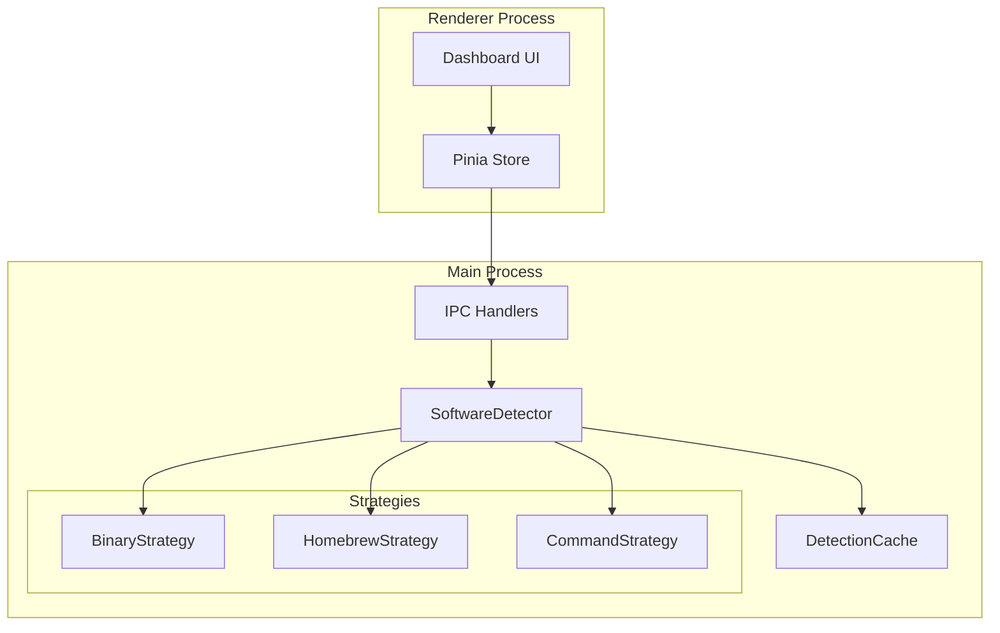
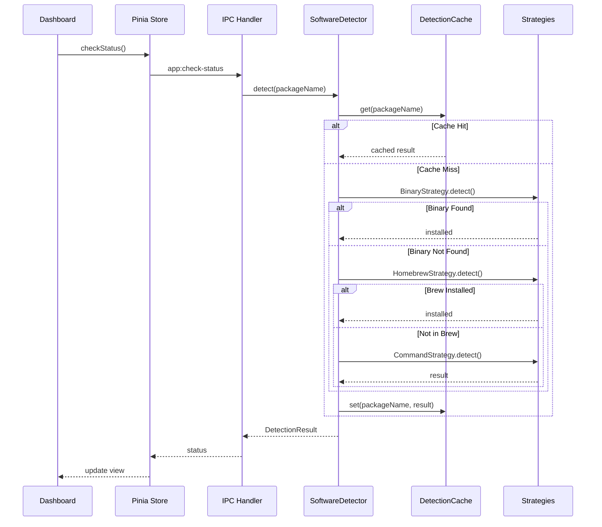

# Design Document: Software Detection Improvement

## Overview

本设计文档描述了软件检测改进功能的技术实现方案。该功能通过引入多策略检测机制，解决当前系统仅依赖 `brew list` 命令导致的检测不准确问题。

核心设计理念：
1. **策略模式** - 使用策略模式实现可扩展的检测机制
2. **优先级链** - 按优先级顺序尝试多种检测策略
3. **缓存机制** - 缓存检测结果以提高性能

## Architecture



检测流程：



## Components and Interfaces

### DetectionStrategy Interface

```typescript
interface DetectionResult {
  installed: boolean;
  version?: string;
  path?: string;
  source?: 'binary' | 'homebrew' | 'command';
}

interface DetectionStrategy {
  name: string;
  detect(packageName: string, config: PackageDetectionConfig): Promise<DetectionResult>;
}

interface PackageDetectionConfig {
  binaryPaths?: string[];
  brewName?: string;
  isCask?: boolean;
  versionCommand?: string;
  versionRegex?: RegExp;
}
```

### BinaryStrategy

检查可执行文件是否存在于已知路径。

```typescript
class BinaryStrategy implements DetectionStrategy {
  name = 'binary';
  
  async detect(packageName: string, config: PackageDetectionConfig): Promise<DetectionResult> {
    const paths = config.binaryPaths || [];
    
    for (const binaryPath of paths) {
      const expandedPath = this.expandPath(binaryPath);
      if (await this.fileExists(expandedPath)) {
        return {
          installed: true,
          path: expandedPath,
          source: 'binary'
        };
      }
    }
    
    return { installed: false };
  }
  
  private expandPath(path: string): string {
    return path.replace(/^~/, process.env.HOME || '');
  }
  
  private async fileExists(path: string): Promise<boolean> {
    try {
      await fs.access(path, fs.constants.X_OK);
      return true;
    } catch {
      return false;
    }
  }
}
```

### HomebrewStrategy

通过 Homebrew 命令检查软件安装状态。

```typescript
class HomebrewStrategy implements DetectionStrategy {
  name = 'homebrew';
  
  private static readonly BREW_PATHS = [
    '/opt/homebrew/bin/brew',  // Apple Silicon
    '/usr/local/bin/brew'       // Intel
  ];
  
  async detect(packageName: string, config: PackageDetectionConfig): Promise<DetectionResult> {
    const brewPath = await this.findBrewPath();
    if (!brewPath) {
      return { installed: false };
    }
    
    const brewName = config.brewName || packageName;
    const listCmd = config.isCask
      ? `"${brewPath}" list --cask ${brewName}`
      : `"${brewPath}" list ${brewName}`;
    
    try {
      await execAsync(listCmd, { timeout: 5000 });
      
      // Get version if installed
      const version = await this.getVersion(brewPath, brewName, config.isCask);
      
      return {
        installed: true,
        version,
        source: 'homebrew'
      };
    } catch {
      return { installed: false };
    }
  }
  
  private async findBrewPath(): Promise<string | null> {
    for (const path of HomebrewStrategy.BREW_PATHS) {
      if (existsSync(path)) {
        return path;
      }
    }
    return null;
  }
  
  private async getVersion(brewPath: string, packageName: string, isCask?: boolean): Promise<string | undefined> {
    // Implementation to get version from brew info
  }
}
```

### CommandStrategy

通过执行版本命令检查软件安装状态。

```typescript
class CommandStrategy implements DetectionStrategy {
  name = 'command';
  
  private static readonly COMMON_PATHS = [
    '/opt/homebrew/bin',
    '/usr/local/bin',
    '/usr/bin',
    '/bin',
    '~/.fnm/aliases/default/bin',
    '~/.nvm/versions/node/*/bin',
    '~/.local/bin'
  ];
  
  async detect(packageName: string, config: PackageDetectionConfig): Promise<DetectionResult> {
    if (!config.versionCommand) {
      return { installed: false };
    }
    
    const env = this.buildEnv();
    
    try {
      const { stdout } = await execAsync(config.versionCommand, {
        timeout: 5000,
        env,
        shell: '/bin/bash'
      });
      
      const version = this.extractVersion(stdout, config.versionRegex);
      
      return {
        installed: true,
        version,
        source: 'command'
      };
    } catch {
      return { installed: false };
    }
  }
  
  private buildEnv(): NodeJS.ProcessEnv {
    const expandedPaths = CommandStrategy.COMMON_PATHS
      .map(p => p.replace(/^~/, process.env.HOME || ''))
      .join(':');
    
    return {
      ...process.env,
      PATH: `${expandedPaths}:${process.env.PATH || ''}`
    };
  }
  
  private extractVersion(output: string, regex?: RegExp): string | undefined {
    const pattern = regex || /v?(\d+\.\d+\.\d+)/;
    const match = output.match(pattern);
    return match ? match[1] || match[0] : undefined;
  }
}
```

### SoftwareDetector

主检测服务，协调多个策略。

```typescript
class SoftwareDetector {
  private strategies: DetectionStrategy[];
  private cache: DetectionCache;
  
  constructor() {
    this.strategies = [
      new BinaryStrategy(),
      new HomebrewStrategy(),
      new CommandStrategy()
    ];
    this.cache = new DetectionCache();
  }
  
  async detect(packageName: string): Promise<DetectionResult> {
    // Check cache first
    const cached = this.cache.get(packageName);
    if (cached) {
      return cached;
    }
    
    const config = this.getPackageConfig(packageName);
    
    // Try each strategy in order
    for (const strategy of this.strategies) {
      const result = await strategy.detect(packageName, config);
      if (result.installed) {
        this.cache.set(packageName, result);
        return result;
      }
    }
    
    const notInstalled: DetectionResult = { installed: false };
    this.cache.set(packageName, notInstalled);
    return notInstalled;
  }
  
  invalidateCache(packageName: string): void {
    this.cache.delete(packageName);
  }
  
  refreshCache(packageName: string): Promise<DetectionResult> {
    this.cache.delete(packageName);
    return this.detect(packageName);
  }
}
```

### DetectionCache

缓存检测结果。

```typescript
interface CacheEntry {
  result: DetectionResult;
  timestamp: number;
}

class DetectionCache {
  private cache: Map<string, CacheEntry> = new Map();
  private ttl: number;
  
  constructor(ttlSeconds: number = 60) {
    this.ttl = ttlSeconds * 1000;
  }
  
  get(packageName: string): DetectionResult | null {
    const entry = this.cache.get(packageName);
    if (!entry) return null;
    
    if (Date.now() - entry.timestamp > this.ttl) {
      this.cache.delete(packageName);
      return null;
    }
    
    return entry.result;
  }
  
  set(packageName: string, result: DetectionResult): void {
    this.cache.set(packageName, {
      result,
      timestamp: Date.now()
    });
  }
  
  delete(packageName: string): void {
    this.cache.delete(packageName);
  }
  
  clear(): void {
    this.cache.clear();
  }
}
```

## Data Models

### Package Detection Configuration

每个软件包的检测配置：

```typescript
const PACKAGE_DETECTION_CONFIGS: Record<string, PackageDetectionConfig> = {
  'homebrew': {
    binaryPaths: [
      '/opt/homebrew/bin/brew',
      '/usr/local/bin/brew'
    ],
    versionCommand: 'brew --version',
    versionRegex: /Homebrew (\d+\.\d+\.\d+)/
  },
  
  'node@20': {
    binaryPaths: [
      '~/.fnm/aliases/default/bin/node',
      '~/.fnm/node-versions/*/installation/bin/node',
      '~/.nvm/versions/node/*/bin/node',
      '/opt/homebrew/opt/node@20/bin/node',
      '/usr/local/opt/node@20/bin/node',
      '/usr/local/bin/node',
      '/usr/bin/node'
    ],
    brewName: 'node@20',
    versionCommand: 'node -v',
    versionRegex: /v(\d+\.\d+\.\d+)/
  },
  
  'git': {
    binaryPaths: [
      '/opt/homebrew/bin/git',
      '/usr/local/bin/git',
      '/usr/bin/git'
    ],
    brewName: 'git',
    versionCommand: 'git --version',
    versionRegex: /git version (\d+\.\d+\.\d+)/
  },
  
  'docker': {
    binaryPaths: [
      '/Applications/Docker.app/Contents/Resources/bin/docker',
      '/usr/local/bin/docker'
    ],
    brewName: 'docker',
    isCask: true,
    versionCommand: 'docker --version',
    versionRegex: /Docker version (\d+\.\d+\.\d+)/
  },
  
  'visual-studio-code': {
    binaryPaths: [
      '/Applications/Visual Studio Code.app/Contents/Resources/app/bin/code',
      '/usr/local/bin/code'
    ],
    brewName: 'visual-studio-code',
    isCask: true,
    versionCommand: 'code --version'
  },
  
  // ... 其他软件包配置
};
```

## Correctness Properties

*A property is a characteristic or behavior that should hold true across all valid executions of a system-essentially, a formal statement about what the system should do. Properties serve as the bridge between human-readable specifications and machine-verifiable correctness guarantees.*

### Property 1: Detection Result Aggregation

*For any* software package with multiple detection strategies configured, if at least one strategy returns `installed: true`, the final detection result SHALL be `installed: true`. Conversely, if all strategies return `installed: false`, the final result SHALL be `installed: false`.

**Validates: Requirements 1.3, 1.4**

### Property 2: Strategy Execution Order

*For any* software package detection, strategies SHALL be executed in the configured order (Binary → Homebrew → Command), and execution SHALL stop as soon as one strategy returns `installed: true`.

**Validates: Requirements 1.2**

### Property 3: Homebrew Command Result Interpretation

*For any* Homebrew strategy execution, if `brew list <package>` returns exit code 0, the result SHALL be `installed: true`. If it returns a non-zero exit code, the result SHALL be `installed: false`.

**Validates: Requirements 2.3, 2.4**

### Property 4: Binary Existence Detection

*For any* binary strategy execution with configured paths, if an executable file exists at any of the configured paths, the result SHALL be `installed: true`. If no executable exists at any path, the result SHALL be `installed: false`.

**Validates: Requirements 3.4, 3.5**

### Property 5: Command Execution Result Interpretation

*For any* command strategy execution, if the version command executes successfully (exit code 0), the result SHALL include `installed: true` and the extracted version. If the command fails or times out, the result SHALL be `installed: false`.

**Validates: Requirements 4.2, 4.3**

### Property 6: Node.js Version Manager Detection

*For any* Node.js detection where Node.js is installed via FNM, NVM, or any other version manager, the Software_Detector SHALL report `installed: true` and extract the correct version.

**Validates: Requirements 5.4, 5.5**

### Property 7: Homebrew File-Based Detection

*For any* Homebrew detection, if the brew executable exists at `/opt/homebrew/bin/brew` or `/usr/local/bin/brew`, the result SHALL be `installed: true`.

**Validates: Requirements 6.4**

### Property 8: Cache Behavior

*For any* detection result that is cached, subsequent detection requests within the TTL period SHALL return the cached result without re-executing detection strategies. After the TTL expires, the cache entry SHALL be invalidated and strategies SHALL be re-executed.

**Validates: Requirements 7.1, 7.2**

### Property 9: Cache Invalidation on State Change

*For any* software package that is installed or uninstalled, the cache entry for that package SHALL be invalidated immediately, ensuring the next detection reflects the current state.

**Validates: Requirements 7.3**

## Error Handling

### Strategy Execution Errors

- 每个策略的执行都应该被 try-catch 包裹
- 单个策略失败不应影响其他策略的执行
- 所有策略失败时返回 `{ installed: false }`

### Timeout Handling

- 命令执行设置 5 秒超时
- 超时视为检测失败，继续尝试下一个策略

### File System Errors

- 文件不存在或无权限访问时返回 `false`
- 不抛出异常，静默处理

## Testing Strategy

### Unit Tests

使用 Vitest 进行单元测试：

1. **BinaryStrategy Tests**
   - 测试文件存在时返回 installed
   - 测试文件不存在时返回 not installed
   - 测试路径展开（~ 替换为 HOME）

2. **HomebrewStrategy Tests**
   - 测试 brew 路径查找
   - 测试 brew list 命令构建
   - 测试版本提取

3. **CommandStrategy Tests**
   - 测试命令执行成功
   - 测试命令执行失败
   - 测试超时处理
   - 测试版本正则匹配

4. **SoftwareDetector Tests**
   - 测试策略执行顺序
   - 测试缓存命中
   - 测试缓存失效

5. **DetectionCache Tests**
   - 测试缓存存取
   - 测试 TTL 过期
   - 测试手动失效

### Property-Based Tests

使用 fast-check 进行属性测试：

1. **Property 1**: 检测结果聚合
2. **Property 3**: Homebrew 命令结果解释
3. **Property 4**: 二进制文件存在检测
4. **Property 5**: 命令执行结果解释
5. **Property 8**: 缓存行为

每个属性测试运行至少 100 次迭代。
