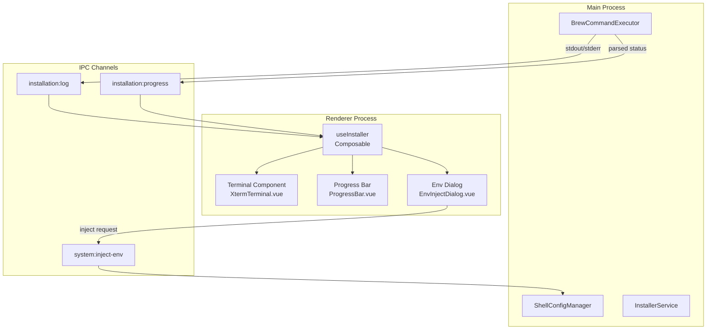
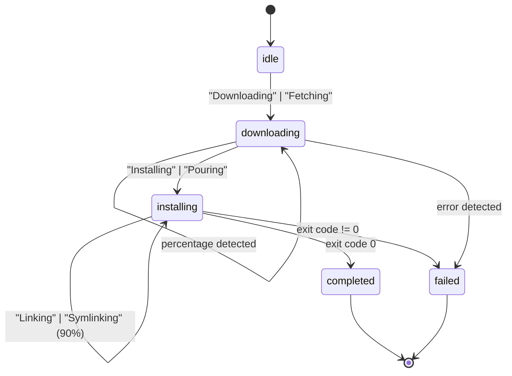

# Design Document: Terminal Installer Integration

## Overview

本设计文档描述了 macOS 开发环境管理工具的三个核心模块增强：真实终端集成、智能进度条和安装后环境注入。系统采用 Electron 架构，主进程负责执行 shell 命令，渲染进程负责 UI 展示，两者通过 IPC 通道通信。

## Architecture



## Components and Interfaces

### 1. BrewCommandExecutor (Main Process)

负责执行 brew 命令并流式传输日志。

```typescript
interface LogData {
  id: string;           // 软件包 ID
  text: string;         // 日志文本
  type: 'stdout' | 'stderr';
  timestamp: number;
}

interface InstallationProgress {
  id: string;
  status: 'idle' | 'downloading' | 'installing' | 'completed' | 'failed';
  progress?: number;    // 0-100
  message?: string;
}

class BrewCommandExecutor {
  static execute(
    window: BrowserWindow,
    options: BrewCommandOptions,
    packageId: string
  ): Promise<BrewCommandResult>;
  
  static parseProgress(text: string, packageId: string): InstallationProgress | null;
}
```

### 2. Progress Parser State Machine

状态机根据日志关键词解析安装进度：



解析规则：

| 关键词 | 状态 | 进度 |
|--------|------|------|
| Downloading, Fetching | downloading | 从日志提取百分比或 indeterminate |
| Installing, Pouring | installing | 50% |
| Unpacking, Extracting | installing | 75% |
| Linking, Symlinking | installing | 90% |
| exit code 0 | completed | 100% |
| exit code != 0 | failed | 0% |

### 3. useInstaller Composable (Renderer)

封装安装逻辑和状态管理：

```typescript
interface UseInstallerReturn {
  // 状态
  logs: Ref<LogEntry[]>;
  progress: Ref<InstallationProgress | null>;
  isRunning: Ref<boolean>;
  currentSoftware: Ref<SoftwareInfo | null>;
  
  // 计算属性
  isIndeterminate: ComputedRef<boolean>;
  progressPercentage: ComputedRef<number>;
  statusMessage: ComputedRef<string>;
  
  // 环境注入弹窗
  showEnvInjectDialog: Ref<boolean>;
  envInjectDialogProps: ComputedRef<EnvDialogProps | null>;
  
  // 方法
  install(software: SoftwareInfo): Promise<boolean>;
  clearLogs(): void;
  handleEnvInjectConfirm(): void;
  handleEnvInjectCancel(): void;
}
```

### 4. ShellConfigManager (Main Process)

管理 shell 配置文件的环境变量注入：

```typescript
interface ConfigResult {
  success: boolean;
  message: string;
}

class ShellConfigManager {
  static detectShell(): 'zsh' | 'bash' | 'fish' | 'unknown';
  static getConfigPath(): string;
  static pathExistsInConfig(path: string): boolean;
  static addPathToConfig(path: string): ConfigResult;
  static removePathFromConfig(path: string): ConfigResult;
}
```

### 5. IPC Channel Definitions

```typescript
// Preload API
interface ElectronAPI {
  // 安装相关
  install(id: string): Promise<boolean>;
  
  // 日志监听
  onTerminalData(callback: (data: LogData) => void): void;
  onInstallationProgress(callback: (data: InstallationProgress) => void): void;
  
  // 环境注入
  injectEnv(path: string): Promise<ConfigResult>;
  
  // 清理
  removeListeners(): void;
}
```

## Data Models

### LogEntry

```typescript
interface LogEntry {
  text: string;
  time: string;
  isError?: boolean;
}
```

### SoftwareInfo

```typescript
interface SoftwareInfo {
  id: string;
  name: string;
  envPath?: string;  // 需要添加到 PATH 的路径
}
```

### Terminal Configuration

```typescript
const terminalConfig = {
  cursorBlink: true,
  fontSize: 13,
  fontFamily: '"JetBrains Mono", "Fira Code", "Menlo", "Monaco", "Courier New", monospace',
  lineHeight: 1.4,
  scrollback: 1000,
  theme: {
    background: '#09090b',
    foreground: '#a1a1aa',
    // ... ANSI colors
  }
};
```

## Correctness Properties

*A property is a characteristic or behavior that should hold true across all valid executions of a system-essentially, a formal statement about what the system should do. Properties serve as the bridge between human-readable specifications and machine-verifiable correctness guarantees.*

### Property 1: Log Data Forwarding

*For any* data emitted from stdout or stderr during command execution, that data SHALL be forwarded to the renderer process via the `installation:log` IPC channel with the correct type ('stdout' or 'stderr').

**Validates: Requirements 1.2**

### Property 2: Progress Parsing Consistency

*For any* log text string, the parseProgress function SHALL return:
- `downloading` status when text contains "Downloading" or "Fetching" (case-insensitive)
- `installing` status at 50% when text contains "Installing" or "Pouring"
- `installing` status at 75% when text contains "Unpacking" or "Extracting"
- `installing` status at 90% when text contains "Linking" or "Symlinking"
- The extracted percentage value when a pattern like "50%" is found in downloading logs

**Validates: Requirements 2.1, 2.2, 2.3, 2.4, 2.7**

### Property 3: Env Dialog Trigger Condition

*For any* installation that completes with exit code 0, if the software has a non-empty envPath defined, the showEnvInjectDialog flag SHALL be set to true.

**Validates: Requirements 3.1**

### Property 4: Path Idempotency

*For any* path string, calling addPathToConfig twice with the same path SHALL result in the path appearing exactly once in the config file, and the second call SHALL return success with an "already exists" message.

**Validates: Requirements 3.4**

## Error Handling

### Command Execution Errors

1. **Spawn Error**: 当 spawn 失败时，发送 `installation:progress` 事件，状态为 `failed`
2. **Non-zero Exit Code**: 当进程以非零退出码结束时，状态设为 `failed`
3. **Stderr with "Error"**: 当 stderr 包含 "Error" 关键词时，立即发送失败状态

### File Operation Errors

1. **Config File Not Found**: 如果配置文件不存在，创建新文件
2. **Write Permission Denied**: 返回 `{ success: false, message: "Permission denied" }`
3. **Path Already Exists**: 返回 `{ success: true, message: "Path already exists" }`（幂等性）

### IPC Communication Errors

1. **Listener Not Registered**: 在 composable 的 onMounted 中注册监听器
2. **Memory Leak Prevention**: 在 onBeforeUnmount 中调用 removeListeners

## Testing Strategy

### Unit Tests

单元测试覆盖以下场景：

1. **parseProgress 函数**
   - 测试各种关键词的状态映射
   - 测试百分比提取
   - 测试无匹配时返回 null

2. **ShellConfigManager**
   - 测试 shell 类型检测
   - 测试配置文件路径获取
   - 测试路径存在性检查

3. **useInstaller Composable**
   - 测试状态初始化
   - 测试日志处理回调
   - 测试进度更新回调

### Property-Based Tests

使用 fast-check 库进行属性测试，每个测试运行至少 100 次迭代。

1. **Property 1: Log Forwarding**
   - 生成随机字符串作为日志内容
   - 验证所有数据都被正确转发

2. **Property 2: Progress Parsing**
   - 生成包含各种关键词的随机日志文本
   - 验证解析结果符合状态机规则

3. **Property 3: Env Dialog Trigger**
   - 生成随机的 SoftwareInfo 对象
   - 验证弹窗触发条件

4. **Property 4: Path Idempotency**
   - 生成随机路径字符串
   - 验证重复添加的幂等性

### Integration Tests

1. **End-to-End Installation Flow**
   - 模拟完整的安装流程
   - 验证日志、进度、弹窗的正确触发

2. **IPC Communication**
   - 验证主进程和渲染进程之间的消息传递
